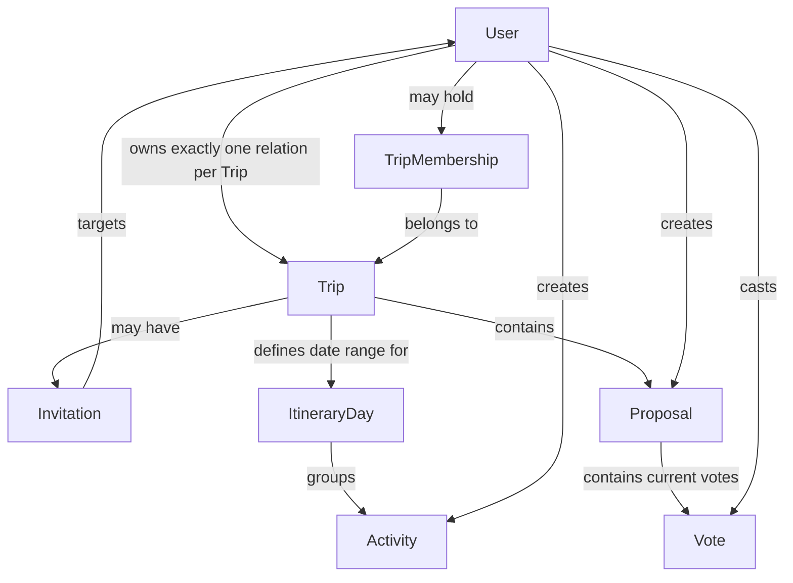

# P0 Domain Model

Status: Draft  
Scope: P0  
Owner: Tech Lead  
Depends on: Frozen P0 Scope, Frozen P0 Business Rules, `00-DOMAIN_VOCABULARY.md`, `01-ARCHITECTURE.md`

## Purpose

This document defines the conceptual P0 domain model.

It describes the core domain objects, their meaning, their relationships, and the business invariants that must remain true across all Vertical Slices.

This document does not define the final Prisma schema, SQL types, primary-key implementation, foreign-key actions, indexes, REST DTOs, or WebSocket payloads. Those details belong to later contracts.

---

# 1. Core Domain Objects

P0 uses the following core domain objects:

- `User`
- `Trip`
- `TripMembership`
- `Invitation`
- `ItineraryDay`
- `Activity`
- `Proposal`
- `Vote`

`Owner` and `Member` are relationship roles, not standalone entities.

`My Trips`, `Trip Workspace`, and `Itinerary` are product/domain views or concepts, not standalone persisted entities by definition.

`TripMembership` is a technical relationship object representing an accepted non-owner Member's current membership in a Trip. The product-facing term remains `Member`.

---

# 2. Domain Relationship Overview



The diagram is conceptual. It does not imply that every box must become a separate database table.

---

# 3. User

A `User` is a registered account in the system.

A User is identified in the product by a unique Username and uses a unique Email for authentication and exact invitation lookup.

P0 requires a User to have:

- Email;
- Username;
- password-based credentials.

A User may:

- own zero or more Trips;
- be a Member of zero or more other Trips;
- receive Invitations;
- create Activities;
- create Proposals;
- cast Votes.

A User does not gain access to a Trip merely because an Invitation exists.

## Domain invariants

- Email is unique across Users.
- Username is unique across Users.
- A User must be registered before being invited.
- Authentication details are handled by the Auth Contract and are not expanded here.

---

# 4. Trip

A `Trip` is the root collaborative workspace for one group trip.

A Trip contains the shared P0 planning state for that trip.

A Trip has:

- Title;
- Destination;
- Start Date;
- End Date;
- optional Description;
- exactly one Owner.

A Trip may also have:

- zero or more current non-owner Members;
- Invitations;
- Itinerary Days;
- Activities;
- Proposals;
- Votes through its Proposals.

## Owner model

The Trip's direct Owner relationship is the single source of truth for ownership in P0.

The Owner is not represented by a second `OWNER` role inside `TripMembership`.

This avoids storing the same ownership fact twice.

P0 therefore does not require role values such as:

- `OWNER`;
- `EDITOR`;
- `VIEWER`.

The Owner has special Trip-level permissions because the User is the Trip's Owner, not because of a membership-role enum.

## Domain invariants

- Every Trip has exactly one Owner.
- The Owner is the User who creates the Trip.
- Ownership cannot be transferred in P0.
- The Owner cannot leave the Trip.
- End Date must not be earlier than Start Date.
- Trip Title, Destination, Start Date, and End Date are required.
- Only the Owner may modify Trip-level details, invite Users, or delete the Trip.

---

# 5. TripMembership

`TripMembership` represents the current accepted membership relationship between a non-owner User and a Trip.

It exists only after an Invitation has been accepted.

It does not represent:

- the Trip Owner;
- a Pending Invitation;
- a declined Invitation;
- a former Member who has already left.

The product-facing User represented by a current TripMembership is called a `Member`.

## Why ownership is not duplicated here

P0 already has exactly one Owner directly on the Trip.

Adding an additional `OWNER` membership row would create two possible ownership sources:

```text
Trip.owner
and
TripMembership.role = OWNER
```

Those two values could disagree.

P0 therefore uses:

```text
Trip.owner
```

for ownership, and:

```text
TripMembership
```

for accepted non-owner Members.

## Domain invariants

- A User may have at most one current TripMembership for the same Trip.
- A Pending Invitation is not a TripMembership.
- Accepting an Invitation creates Membership.
- Declining an Invitation does not create Membership.
- Leaving a Trip removes the current Membership.
- Removing Membership immediately removes future Trip Workspace access.
- Historical Activity and Proposal contributions are not deleted when Membership ends.

---

# 6. Invitation

An `Invitation` represents an Owner asking an already registered User to join a Trip.

An Invitation relates:

- one Trip;
- one invited User.

In P0, only the Trip Owner can create an Invitation.

Because ownership cannot be transferred in P0, the inviter is derivable from the Trip Owner and does not require a separate inviter role in the conceptual model.

## Invitation lifecycle

The important domain distinction is whether an Invitation is currently pending.

Conceptually:

```text
Invitation created
       |
       v
    PENDING
     /   \
    /     \
ACCEPT   DECLINE
  |         |
  v         v
Membership  No Membership
created
```

The Database Contract will decide whether accepted or declined Invitation records are retained or removed. P0 does not require invitation-history features.

## Domain invariants

- Only registered Users may be invited.
- Only the Owner may invite.
- A Pending Invitation does not grant Trip access.
- There may be at most one effective Pending Invitation for the same Trip and invited User.
- A User who is already a current Member cannot receive another effective Invitation for the same Trip.
- After a decline, the Owner may invite the same User again later.
- Accepting creates Membership and ends the Pending Invitation state.
- Declining ends the Pending Invitation state without creating Membership.

---

# 7. Itinerary and ItineraryDay

`Itinerary` is the complete day-by-day plan of a Trip.

It is a domain/product concept and does not require its own standalone persisted entity.

An `ItineraryDay` represents one calendar date inside the inclusive Trip date range:

```text
Start Date ... End Date
```

Itinerary Days are generated by the system from the Trip date range.

Users do not manually create or delete Itinerary Days.

## Persistence note

`ItineraryDay` is part of the domain model, but this document does not require a dedicated `ItineraryDay` database table.

The Database Contract may choose either to persist ItineraryDay records or derive them from the Trip date range, provided all Business Rules remain satisfied.

## Date-range invariants

- There is conceptually one ItineraryDay for each date from Start Date through End Date.
- Extending the Trip date range creates additional available days without changing existing Activities.
- Shrinking the Trip date range is allowed when removed days contain no Activities.
- If shrinking would remove a day containing an Activity, the entire Trip date update must be rejected.
- Activities must always belong to a date inside the current Trip date range.

---

# 8. Activity

An `Activity` is one planned item in the Trip Itinerary.

An Activity belongs to exactly one Trip date / ItineraryDay.

P0 Activity business data includes:

- Title;
- Date;
- Start Time;
- optional End Time;
- optional Location;
- optional Description;
- Creator.

The Creator is the User who originally created the Activity.

Creator identity does not create exclusive ownership of the Activity.

All current Trip participants with workspace access, including the Owner and current Members, may create, read, update, and delete Activities according to the Business Rules.

## Domain invariants

- Title is required.
- Date must be inside the Trip date range.
- Start Time is required.
- End Time is optional.
- If End Time exists, it must not be earlier than Start Time.
- Activities are ordered by Start Time within their date.
- Activities may overlap in time.
- Activity Creator is recorded.
- Creator status does not give exclusive edit or delete rights.
- P0 has no per-Activity participant list.
- P0 has no Activity Confirmed / Locked lifecycle.
- P0 has no drag-and-drop ordering contract.

## Concurrent updates

P0 requires stale concurrent Activity updates not to silently overwrite newer state.

The domain requirement is:

> a stale Activity update must be detected and rejected.

The exact implementation, such as a version field and HTTP `409 Conflict`, is deferred to the Database and REST API contracts.

---

# 9. Proposal

A `Proposal` is an optional group decision object inside a Trip.

It is used when current Trip participants want to collect Yes / No opinions about an undecided travel choice.

A Proposal belongs to exactly one Trip.

P0 Proposal business data includes:

- Title;
- Description;
- Creator;
- Created At.

The Creator is the User who creates the Proposal.

## Domain invariants

- Current Trip participants, including the Owner, may create Proposals.
- The Proposal Creator may vote on their own Proposal.
- A Proposal does not require Owner approval.
- A Proposal is not a required step before creating an Activity.
- A Proposal does not automatically become an Activity.
- P0 has no Proposal status such as Passed or Rejected.
- P0 has no Proposal deadline or Close action.
- P0 has no Proposal edit or delete action.
- P0 has no Proposal options collection beyond the shared Yes / No Vote model.
- P0 has no required Proposal-to-Activity relationship.

---

# 10. Vote

A `Vote` represents one User's current Yes / No choice on one Proposal.

A Vote belongs to:

- exactly one Proposal;
- exactly one voting User.

The canonical P0 vote values are:

```text
YES
NO
```

## Domain invariants

- Only current Trip participants may vote on a Proposal belonging to that Trip.
- The Proposal Creator may vote.
- A voting User has at most one current Vote per Proposal.
- Changing from `YES` to `NO`, or from `NO` to `YES`, updates the current choice rather than adding another current Vote.
- Votes do not automatically produce Passed / Rejected Proposal state.
- P0 has no tie-break rule.
- P0 has no Owner final-decision rule.
- P0 has no Abstain value.

## Membership-ending behaviour

When a Member leaves a Trip, that User's Votes in the Trip must no longer count as current Votes.

P0 does not require vote audit history.

The Database Contract may therefore use deletion of those current Votes as the simplest implementation.

---

# 11. Access Model at Domain Level

A User may access a Trip Workspace when the User is either:

```text
the Trip Owner
OR
a current Member represented by TripMembership
```

A Pending Invitation alone does not satisfy this rule.

Conceptually:

```text
canAccessTrip(user, trip)
=
trip.owner == user
OR
current TripMembership exists for user + trip
```

This is a domain rule only.

The Auth Contract defines how the backend authenticates the User and enforces this rule technically.

---

# 12. My Trips at Domain Level

`My Trips` is not a standalone entity.

For a User, the My Trips result is conceptually:

```text
Trips owned by the User
UNION
Trips where the User has a current TripMembership
```

Pending Invitations are displayed separately and do not become part of My Trips until accepted.

---

# 13. Important Lifecycle Rules

## 13.1 Accept Invitation

```text
Pending Invitation
        ↓
      Accept
        ↓
Create current TripMembership
        ↓
User gains Trip Workspace access
        ↓
Trip appears in My Trips
```

## 13.2 Decline Invitation

```text
Pending Invitation
        ↓
      Decline
        ↓
No TripMembership created
        ↓
No Trip Workspace access
```

The same User may be invited again later.

## 13.3 Leave Trip

```text
Current non-owner Member
        ↓
     Leave Trip
        ↓
Remove current TripMembership
        ↓
Remove access immediately
        ↓
Trip disappears from My Trips
```

Historical Activities and Proposals created by that User remain.

That User's current Votes in the Trip must no longer count.

## 13.4 Delete Trip

Deleting a Trip deletes the entire P0 workspace associated with that Trip.

Conceptually this includes:

- TripMemberships;
- Invitations;
- Itinerary Day state if persisted;
- Activities;
- Proposals;
- Votes.

P0 has no archive, restore, or trash lifecycle.

The exact foreign-key and cascade implementation is defined in the Database Contract.

---

# 14. Domain Boundaries and Non-Entities

The following P0 concepts must not accidentally become unnecessary standalone entities merely because they appear in the UI or Business Rules:

- `Owner` — a User-to-Trip role;
- `Member` — a User with current TripMembership;
- `My Trips` — a query/view;
- `Trip Workspace` — a product area;
- `Itinerary` — a day-organized domain view;
- `Accept` — an action;
- `Decline` — an action;
- `Leave Trip` — an action;
- `Realtime Update` — a delivery mechanism.

Creating a database table for any of these requires a separate technical reason and is not implied by this Domain Model.

---

# 15. Explicit P0 Domain Exclusions

The P0 Domain Model does not contain:

- `Message`;
- `Chat`;
- `Notification`;
- `Friend`;
- `Expense`;
- `File` / `TripDocument`;
- `ActivityParticipant`;
- `ProposalStatus`;
- `ProposalOption`;
- `OwnershipTransfer`;
- Activity approval / confirmation entities;
- audit-history entities.

Future phases may extend the Domain Model, but those concepts must not be introduced into P0 implementation without an explicit scope change.

---

# 16. Decisions Deferred to Later Contracts

This Domain Model intentionally does not decide:

- UUID versus another primary-key representation;
- exact Prisma model syntax;
- database column names and SQL types;
- foreign-key `CASCADE`, `RESTRICT`, or `SET NULL` details;
- whether `ItineraryDay` is persisted or derived;
- whether terminal Invitation records are retained;
- password hashing implementation;
- authentication token/cookie strategy;
- Activity concurrency field implementation;
- REST endpoint paths;
- REST request/response DTOs;
- WebSocket room names, event names, and payloads;
- shared TypeScript package structure.

Those decisions belong to the Database, Auth, REST, Realtime, and Shared Types contracts.

---

# Review Checklist

Before freezing this document, the team should confirm:

- [ ] The eight core P0 domain objects are sufficient.
- [ ] `Owner` is a direct Trip relationship and is not duplicated as a membership role.
- [ ] `TripMembership` represents accepted non-owner Members only.
- [ ] Pending Invitation and Membership are separate concepts.
- [ ] Accepting an Invitation creates Membership.
- [ ] Leaving removes Membership but preserves historical Activities and Proposals.
- [ ] Votes from a User who leaves no longer count.
- [ ] `ItineraryDay` is understood as a domain concept even if persistence remains undecided.
- [ ] Activities belong to a valid Trip date and are ordered by Start Time.
- [ ] Proposal and Activity are independent domain objects.
- [ ] Proposal has no P0 Passed / Rejected lifecycle.
- [ ] Vote means one current `YES` or `NO` choice per User per Proposal.
- [ ] `My Trips`, `Trip Workspace`, and `Itinerary` are not being mistaken for required database entities.
- [ ] Message / Chat and other future concepts have not entered the P0 model.
