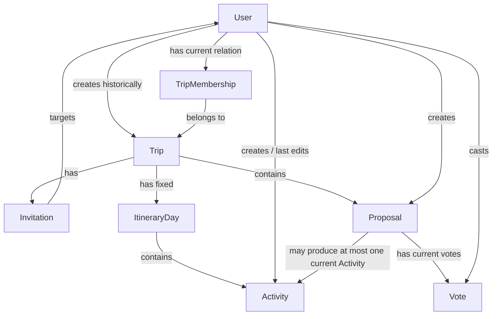

# P0 Domain Model

Status: Draft  
Scope: P0  
Owner: Tech Lead  
Depends on: Frozen P0 Scope, Frozen P0 Business Rules v2, `00-DOMAIN_VOCABULARY.md`, `01-ARCHITECTURE.md`

## Purpose

This document defines the conceptual P0 domain model.

It describes the core domain objects, their relationships, lifecycle rules, and business invariants that must remain true across all Vertical Slices.

It does not define final Prisma syntax, exact SQL types, exact transaction isolation levels, exact locking statements, REST status codes, or Socket.IO payloads. Those details belong to later technical contracts.

---

# 1. Core Domain Objects

P0 uses these core domain objects:

- `User`
- `Trip`
- `TripMembership`
- `Invitation`
- `ItineraryDay`
- `Activity`
- `Proposal`
- `Vote`

`Owner` and `Member` are Membership Roles, not standalone entities.

`My Trips`, `Trip Workspace`, `Itinerary`, `Adoption`, `Accept`, `Reject`, and `Leave Trip` are views, states, or actions rather than standalone P0 entities.

---

# 2. Domain Relationship Overview



Exact foreign-key direction and database constraints are defined in the Database Contract.

---

# 3. User

A `User` is a registered account with unique Email and Username and password-based credentials.

A User may create Trips, hold TripMemberships, receive Invitations, create/edit Activities, create Proposals, cast Votes, and Adopt eligible Proposals.

An Invitation alone does not grant Trip Workspace access.

---

# 4. Trip

P0 Trip business data includes Title, Destination, Start Date, End Date, optional Description, historical Creator, and current Memberships.

## Creator vs Owner

The Trip Creator records who originally created the Trip.

At creation:

```text
Creator
→ receives TripMembership(role = OWNER)
```

Authorization must never use Creator identity as the Owner check.

The current Owner is determined only by:

```text
TripMembership.role = OWNER
```

## Trip immutability

After creation, P0 does not allow modification of Title, Destination, Start Date, End Date, or Description.

The Owner may delete the Trip but may not edit those fields.

## Domain invariants

- every Trip has exactly one current `OWNER` TripMembership;
- a User may have at most one current TripMembership for the same Trip;
- the Creator receives the initial `OWNER` Membership;
- ownership cannot be transferred in P0;
- the Owner cannot Leave Trip;
- Title, Destination, Start Date, and End Date are required;
- End Date must not be earlier than Start Date;
- only the current Owner may invite Users or delete the Trip;
- Trip base information is immutable after creation.

---

# 5. TripMembership

Every current Trip participant has one TripMembership with role:

```text
OWNER
MEMBER
```

## Domain invariants

- `Trip + User` has at most one current TripMembership;
- every Trip has exactly one `OWNER` Membership;
- Accepting an Invitation creates a `MEMBER` Membership;
- Pending Invitation is not Membership;
- a `MEMBER` may Leave Trip;
- an `OWNER` may not Leave Trip;
- removing Membership immediately removes future Workspace access;
- leaving preserves historical Activity and Proposal contributions;
- Votes belonging to a leaving Member must no longer remain active and must never reactivate automatically if the User later rejoins.

---

# 6. Invitation

Canonical P0 status values are:

```text
PENDING
ACCEPTED
REJECTED
```

The UI may display `Decline`, but the technical terminal status is `REJECTED`.

## Domain invariants

- only the current Owner may create an Invitation;
- only registered Users may be invited;
- Pending does not grant Workspace access;
- at most one effective `PENDING` Invitation exists per Trip + Invitee;
- an existing current participant cannot receive another effective Invitation;
- Accept → `ACCEPTED` + create `MEMBER` Membership;
- Reject → `REJECTED` + no Membership;
- after Reject, the same User may be invited again later.

---

# 7. Itinerary and ItineraryDay

All ItineraryDays are created when the Trip is created.

## Domain invariants

- exactly one ItineraryDay per Trip date;
- Days cover the inclusive Start Date–End Date range;
- Users cannot manually create or delete Days;
- Trip dates cannot change after creation;
- Days are not shifted or renumbered;
- deleting the Trip deletes its Days;
- every Activity must belong to one valid ItineraryDay of the same Trip;
- P0 has no Unscheduled Activity Pool.

---

# 8. Activity

An Activity belongs to exactly one Trip and exactly one valid ItineraryDay of that same Trip.

P0 Activity business data includes Title, Day/Date, Start Time, optional End Time, optional Location, optional Description, Creator, Last Editor, Last Edited At, and optional system creation timestamp.

## Proposal origin

An Activity may optionally originate from Proposal Adoption.

The current data model represents this origin with:

```text
activity.proposal_id
```

Rules:

- direct Activity creation → `proposal_id` is null;
- Proposal Adoption → `proposal_id` references the adopted Proposal;
- one Proposal may have at most one current Activity created from it;
- an Activity may reference at most one source Proposal;
- persistence must enforce this one-to-one current-adoption invariant.

The exact SQL type and unique-index syntax belong to the Database Contract.

## Other invariants

- Title is required;
- Day/Date is required and must belong to the Activity's Trip;
- Start Time is required;
- End Time is optional but must not be earlier than Start Time;
- Activities are ordered by Start Time within a Day;
- overlap is allowed;
- all current participants may CRUD Activities;
- Creator does not give exclusive edit/delete permission;
- Last Editor and Last Edited At are system-controlled;
- P0 has no Activity attendance, Locking/Confirmed state, Unscheduled state, or drag-and-drop ordering.

## Concurrent updates

A stale Activity update must not silently overwrite newer committed state.

The exact OCC mechanism belongs to the Database and REST contracts.

---

# 9. Proposal

A Proposal is an optional group-decision object.

P0 Proposal data includes Title, optional Description, Creator, Created At, and `is_adopted`.

Meaning:

```text
is_adopted = false
→ Proposal is currently not adopted

is_adopted = true
→ Proposal has been manually adopted
```

`is_adopted` is the adoption marker. It is not itself the Proposal-to-Activity relation.

P0 has no automatic Passed/Rejected result status, no Deadline, no Proposal Edit/Delete, and no multi-option list.

---

# 10. Vote

A Vote represents one current explicit decision on one Proposal.

Persisted Vote decisions are:

```text
AGREE
REJECT
```

A User with no Vote row is logically unvoted.

For UI/domain discussion, this may be described as `PENDING / NOT VOTED`, but `PENDING` is not a third persisted Vote decision value.

## Domain invariants

- only current Trip participants may vote;
- at most one current Vote exists per Proposal + User;
- changing `AGREE ↔ REJECT` updates the existing current Vote;
- no Vote row means not voted;
- P0 has no persisted `ABSTAIN` value;
- Vote creation/change is allowed only while `Proposal.is_adopted == false`;
- once Adoption succeeds, Vote creation/change is locked;
- when a Member leaves, the old Vote must not remain active or later reactivate.

## Retraction note

The frozen P0 rules define not-voted = no Vote row, AGREE/REJECT as the two explicit decisions, and changing an existing Vote before Adoption.

They do not currently define a separate user action for retracting an existing Vote back to not-voted.

A retract endpoint/interaction must not be added unless the product rules explicitly include it.

---

# 11. Strict Majority

Let:

```text
N = total number of current Trip participants
A = number of current AGREE Votes
```

Adoption eligibility:

```text
A > N / 2
```

Equivalent minimum:

```text
A >= floor(N / 2) + 1
```

## Denominator rule

`N` always includes the Owner, every current MEMBER, and participants who have not voted.

Not-voted participants therefore still increase the denominator.

Former participants are not included.

---

# 12. Adoption

Any Current Trip Participant may request Adoption.

A successful Adoption must behave atomically:

1. verify current TripMembership;
2. verify Proposal belongs to the Trip;
3. verify `Proposal.is_adopted == false`;
4. recompute current participant count;
5. recompute current AGREE Vote count;
6. verify Strict Majority still holds at submission time;
7. validate Activity scheduling inputs;
8. create the Activity with `activity.proposal_id` referencing the Proposal;
9. set `Proposal.is_adopted = true`;
10. commit;
11. broadcast only after commit.

## Lost-majority race

The backend must not trust the majority state that existed when the user opened the Adoption form.

```text
A opens scheduling form while majority is satisfied
→ B changes a Vote before A submits
→ majority is no longer satisfied
→ A submits
→ backend rechecks current state and rejects Adoption
```

In this case:

- no Activity is created;
- `Proposal.is_adopted` remains `false`;
- the request is treated as a business-state conflict.

The exact REST status/error code belongs to the REST API Contract.

## Concurrent Adoption

Two Users may submit Adoption at almost the same time.

Persistence must guarantee:

```text
one Proposal
→ at most one current Activity created by Adoption
```

The exact locking/isolation strategy belongs to the Database Contract.

---

# 13. Delete Adopted Activity / Re-Adopt

When an Activity is deleted:

- if `activity.proposal_id` is null, normal Activity deletion occurs;
- if `activity.proposal_id` references a Proposal, deletion must also return that Proposal to the unadopted state.

Conceptually:

```text
delete Proposal-sourced Activity
+
set Proposal.is_adopted = false
```

These changes must be atomic/consistent.

Afterward:

- Proposal remains;
- existing valid Vote data remains;
- voting is available again under pre-Adoption rules;
- later Adoption must recompute and satisfy current Strict Majority;
- a new Activity may then be created from that Proposal.

---

# 14. Access Model

Workspace access:

```text
current TripMembership exists
```

Owner-only authorization:

```text
TripMembership.role == OWNER
```

Historical `created_by` is never an authorization source.

---

# 15. Important Lifecycles

## Create Trip

```text
Create Trip
→ create Creator Membership(role = OWNER)
→ generate all ItineraryDays
→ commit
```

## Accept Invitation

```text
PENDING
→ ACCEPTED
→ create Membership(role = MEMBER)
```

## Reject Invitation

```text
PENDING
→ REJECTED
→ no Membership
```

## Leave Trip

```text
MEMBER leaves
→ remove Membership
→ remove access
→ historical Activity/Proposal remain
→ old Vote no longer remains active
```

## Adopt Proposal

```text
is_adopted = false
→ current Strict Majority satisfied at submit time
→ create Activity(proposal_id = proposal.id)
→ is_adopted = true
```

## Delete adopted Activity

```text
delete Activity with proposal_id
→ is_adopted = false
→ existing Vote data remains
→ future Adoption must satisfy current majority again
```

## Delete Trip

Delete the complete Workspace, including Memberships, Invitations, Days, Activities, Proposals, and Votes.

P0 has no Archive / Restore / Trash.

---

# 16. Deferred Database Decisions

The Domain Model has already fixed these domain facts:

- Proposal-sourced Activity uses the `proposal_id` origin relation;
- one Proposal may produce at most one current adopted Activity;
- current Vote uniqueness is one Vote per `(Proposal, User)`;
- departed Members' Votes must not remain active or later reactivate.

The Database Contract still decides the exact technical mechanisms for:

- UUID / PK implementation;
- exact FK declarations;
- exact unique-index syntax;
- exact strategy for enforcing one `OWNER` Membership per Trip;
- exact strategy for one effective `PENDING` Invitation;
- exact physical Vote cleanup implementation;
- exact transaction isolation / row-locking strategy;
- exact foreign-key delete actions;
- Activity OCC/version implementation.
